# Variational AutoEncoders
- Implements the paper [Auto-Encoding Variational Bayes](https://arxiv.org/pdf/1312.6114.pdf) by Kingma et al.
- Inspired by [Aladdin Persson](https://www.youtube.com/watch?v=VELQT1-hILo&t=2002s)'s YouTube video.

## Generated Outputs
### Zero

### One

### Two

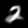
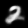
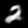

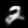
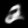
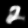

### Three

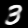

### Four
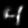
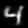

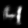
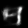
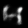
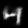

### Five

### Six

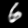
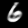
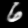
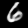

### Seven

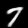

### Eight

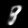

### Nine
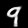
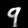
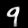
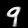
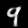
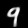
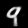

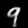
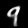

## Notes:
- [TODO] As we can see from the outputs, the alignments of all the outputs are the same, this is because there is some high bias & low variance in the inputs & the model does not learn the general shape of the digits. Instead, it learns the digits along with their orientations. This can be overcome by including some transforms while training the data.